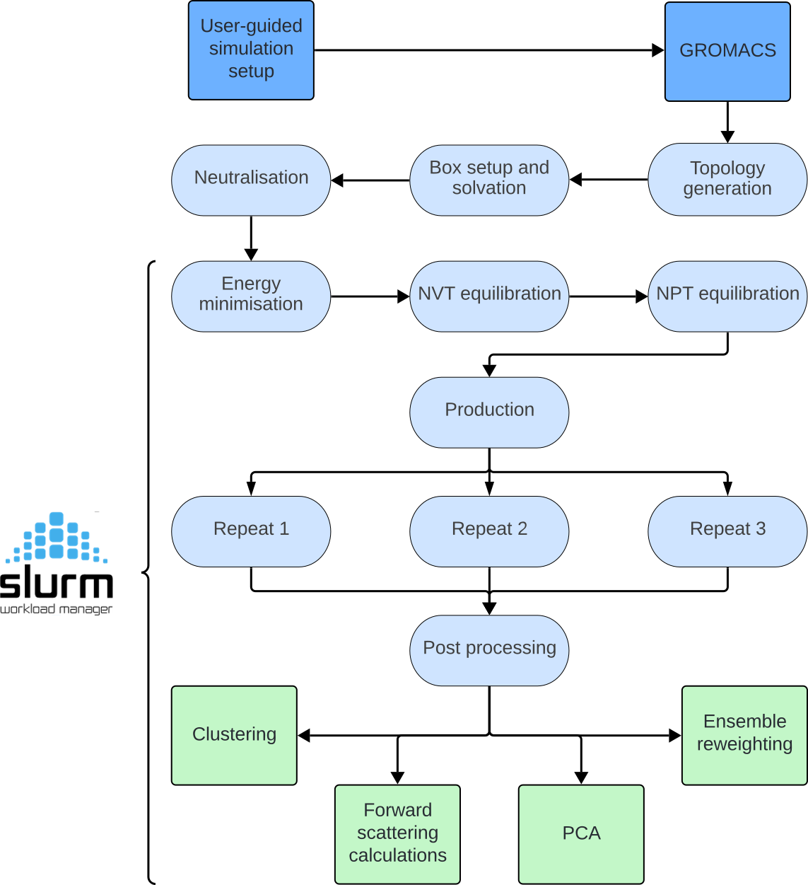

# AutoMD-SAXS

<p align="center">
  
</p>

AutoMD-SAXS is an automated workflow for the setup, simulation and SAXS-based analysis of protein and protein-ligand systems. Built for use on HPC using the Slurm job scheduler.

## Installation
### Software requirements:
  - GROMACS (local install or module loaded)
  - Slurm job scheduler
  - Conda 
  - ATSAS 
      - Download only required for SAXS-based analysis 
      - Current analysis is optimised for ATSAS 3.0.4 (recommended)
   
### Setting up the Python environment

```bash
# Create a new conda environment
conda env create -f automdsaxs.yml
# Activate environment
conda activate automdsaxs
```

## Usage

### File requirements
  - Protein (.pdb)
  - SAXS data (.dat)

Note: Both files must be present within the AutoMD-SAXS directory

### Simulation setup
```bash
cd /path/to/AutoMD-SAXS 
```

```bash
sh simulation_setup.sh -p *Protein*.pdb -s *SAXS*.dat 
```
- Flag -s is optional. Running without -s will not invoke SAXS-based trajectory analysis
- Outputs the directory ```*Protein*_simulation ```
- User will be prompted to answer questions related to their system. Answers outputted as variables to ```/AutoMD-SAXS/*Protein*_simulation/configurations.txt ```

For full documentation please read xyz.pdf 

### Run the simulation

```bash
sh run_MD.sh *Protein*_simulation 
```

## Directory layout

```bash
ff_convert/
```
Invoked by ```simulation_setup.sh```, this directory contains scripts that recast the input PDB’s atom names and residue labels into the conventions required by the AMBER and CHARMM force fields. 

```bash
slurms/ 
```
Holds all of the Slurm submission scripts that drive the pipeline. Users can modify the #SBATCH lines of these scripts to fit their own cluster’s scheduler settings or resource requirements.

```bash
mdp_files/
```
GROMACS .mdp parameter files for each simulation stage. These templates work “out of the box,” but more experienced MD users may wish to tailor these parameters to their specific system or research needs.

## Citation

If you use AutoMD-SAXS in your research...

```bibtex
@article{,
  title={},
  author={},
  journal={},
  year={2025},
  doi={},
  url={}
}

```
Shield:
This work is licensed under...
